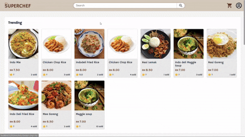

## 🍱 Canteen Pre-Order System
A web-based system that allows students or staff to pre-order food and drinks from the campus canteen before arrival.
The system reduces long queues, improves order accuracy, and helps vendors manage daily food preparation efficiently.
It also provides an admin interface for canteen vendors to manage menus, order schedules, and track sales.

## 🖥️ Preview

### 🎟️ Food Pre-ordering
Browse movies, choose a showtime, select seats, and confirm your booking.

### 🍿 Vendor Management
Order snacks and drinks along with your movie ticket.

### ⚙️ Admin Management
Manage movies, showtimes, seat layouts, and F&B items.

---

## 🚀 Features

### 🎟 User Features

### 🧑‍💼 Admin Features
