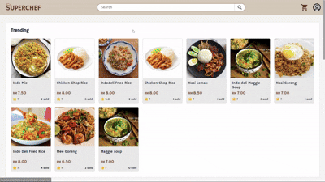
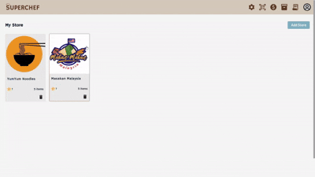
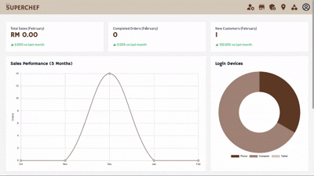

## 🍱 Canteen Pre-Order System
A web-based system that allows students and staff to browse available canteen food, pre-order meals, select pickup times and make cashless payments easily.

## 🖥️ Preview

### 🎟️ Food Pre-ordering
Browse movies, choose a showtime, select seats, and confirm your booking.

### 🍿 Vendor Management
Order snacks and drinks along with your movie ticket.

### ⚙️ Admin Management
Manage movies, showtimes, seat layouts, and F&B items.

---

## 🚀 Features

### 🎟 User Features
- Browse available food and beverages by category.
- View food details, prices and availability.
- Pre-order meals in advance to avoid long queues.
- Select preferred pickup date and time slot.
- View order history and order status.
### 🏪 Vendor Features
- Manage incoming orders in real time.
- Update order status (e.g., Preparing, Ready for Pickup, Completed).
- Manage menu items, pricing, and daily stock availability.
- View daily sales summary and order reports.
### 🧑‍💼 Admin Features
- Add, edit, or remove vendor accounts.
- Manage overall food categories and system settings.
- Monitor all orders and transactions.
- Generate system-wide sales and performance reports.
